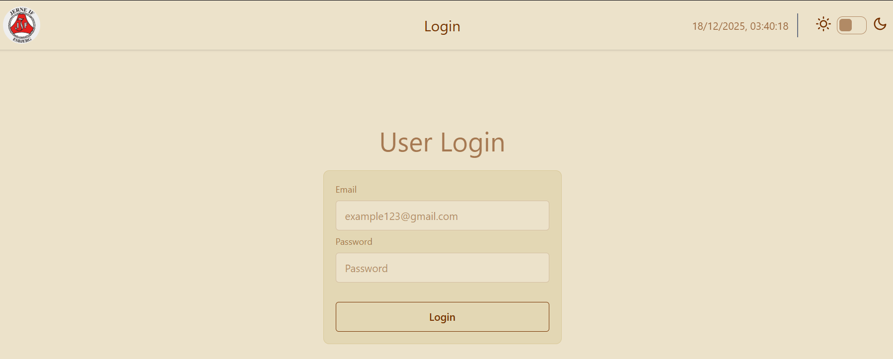
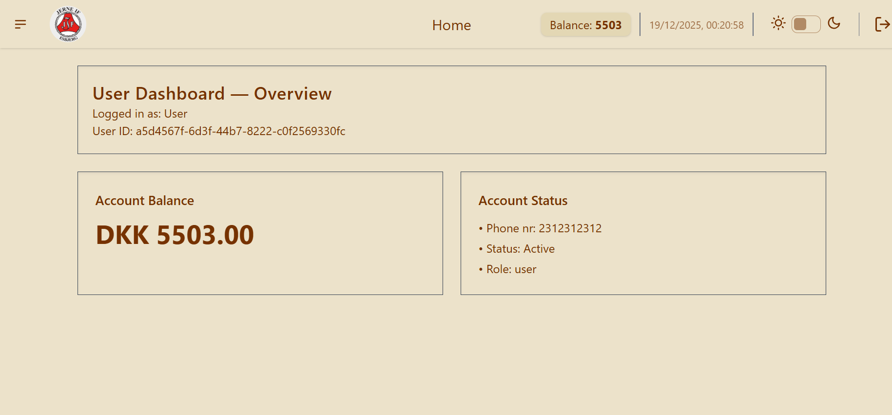
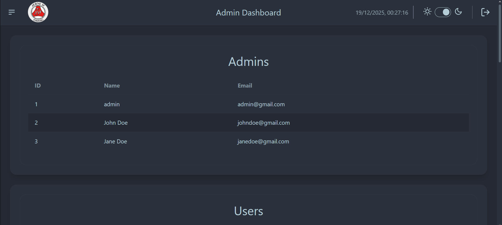
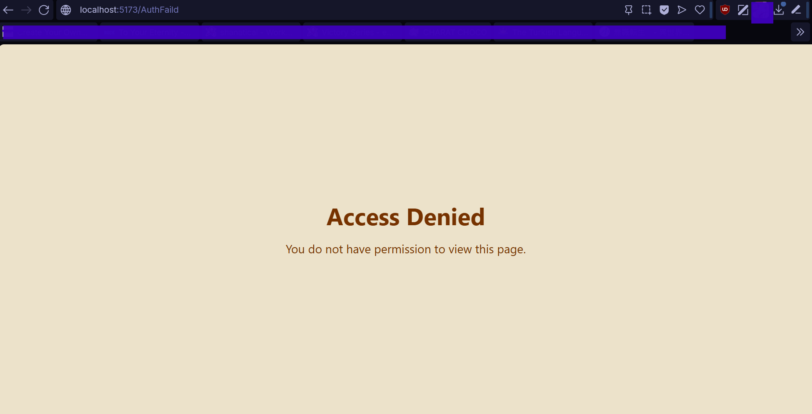

# Dead Pigeons


## Overview

This project is a digital implementation of the game **Dead Pigeons**, run by the local sports club **Jerne IF**.  
It is structured as a client-server application with a React frontend and an ASP.NET backend.

## Project Structure

- `client/` – Frontend application (React + TypeScript)
- `server/` – Backend API (ASP.NET)
- `.github/` – GitHub configuration and CI workflows

## Getting Started

### 1. Clone the repository

```bash
git clone https://github.com/ABXM1209/deadpigeons.git
cd deadpigeons
```

### 2. Client-side setup

```bash
cd .\client\
npm i
npm run dev
```
The client will be available at:
http://localhost:5173



### 3. Server-side setup
```bash
cd .\server\api\
dotnet build
dotnet run
```

### 4. Test accounts

Use the following test users to log in:


 ### **User:**
> Email: user@gmail.com 
> 
> Password: user



### **Admin:**
> Email: admin@gmail.com 
> 
> Password: admin
>



### Authorization & Security
The application uses **role-based authorization** with two roles:
- `admin`
- `user`

### Client-side authorization
Routing is protected using a `PrivateRoute` component combined with role checks.

- The authenticated user’s role is stored in a global Jotai atom (`userAtom`)
- An `AuthProvider` exposes the current role via React Context
- Routes declare which roles are allowed

Example:
```tsx
<PrivateRoute allowedRoles={["admin"]}>
    <AdminBoard />
</PrivateRoute>
```
Unauthorized access redirects the user to an authorization failure page.



### Server-side authorization
- Protected API endpoints require authentication 
- User roles are validated server-side before executing admin-only actions 
- Client-side checks are used for UX only and are not relied on for security
## Environment & Configuration
### Client
- Node.js: **v18+ recommended**
- Package manager: npm
- Framework: React + TypeScript + Vite
#### Configuration:
- Uses standard Vite environment variables 
- No secrets are stored in the client repository

### Server
- .NET SDK: **.NET 10**
- The server runs as an ASP.NET API
#### Configuration:
- Environment-specific settings are handled via `appsettings.json` and environment variables
- Development configuration is used by default when running locally

## Linting & Code Quality

### Client
- TypeScript with strict typing enabled 
- ESLint configured via the default Vite + React template 
- Formatting follows standard ESLint and Prettier conventions

Linting is primarily enforced during development rather than CI.

### Server
- C# code follows standard .NET conventions
- Compiler warnings and errors are surfaced during `dotnet build`

## Project Status

### Implemented Features
- User authentication and login
- Role-based access control (admin vs user)
- Admin dashboard and user management
- User purchases and transaction history
- REST-based client-server communication

### Known Limitations / Bugs
- Bug #1: XXX


